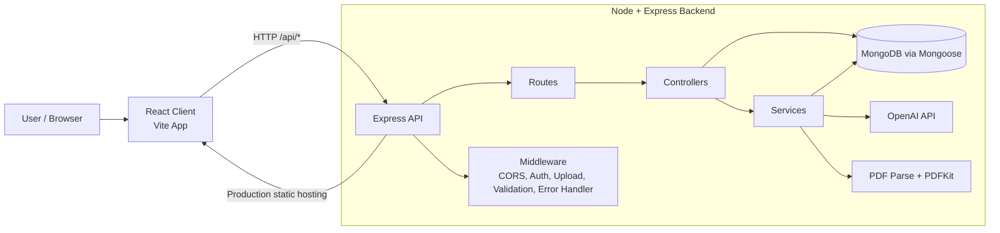
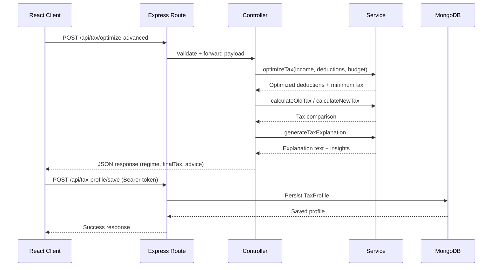
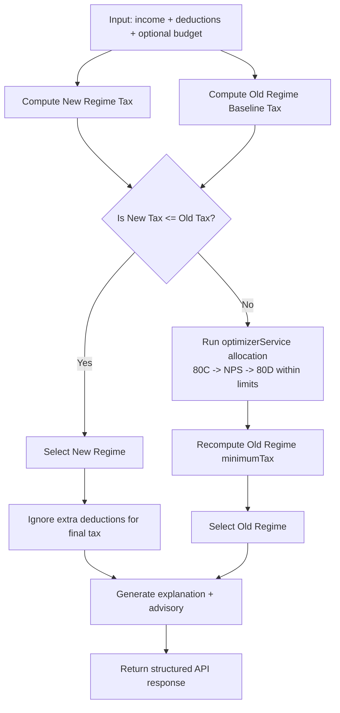

# Smart Tax Engine

Smart Tax Engine is a full-stack tax planning platform for Indian taxpayers. It provides tax comparison (old vs new regime), deduction optimization, simulation, goal-based planning, AI-assisted input parsing, Form 16 PDF extraction, and downloadable tax reports.

## Features

- Old vs New regime tax calculation
- Advanced deduction optimization (`80C`, `80D`, `NPS`) with budget allocation
- Goal-based tax reduction planning
- Scenario simulation for deduction changes
- HRA and capital gains tax calculators
- AI parsing from free text and chat prompts
- Form 16 PDF upload + structured data extraction
- JWT-based auth and tax history persistence
- PDF tax report generation

## Tech Stack

- Backend: Node.js, Express, Mongoose, JWT, Multer, PDFKit, OpenAI SDK
- Frontend: React (Vite), Tailwind CSS, Recharts
- Database: MongoDB

## Project Structure

```text
smart-tax-engine/
|-- app.js                 # Express app wiring and middleware
|-- server.js              # Entry point: env load, DB connect, server start
|-- config/
|   `-- db.js              # MongoDB connection
|-- controllers/           # HTTP handlers
|-- routes/                # API route modules
|-- services/              # Core business logic
|-- models/                # Mongoose schemas (User, TaxProfile)
|-- middleware/            # Auth + file upload middleware
|-- utils/                 # Validation + centralized error handler
|-- uploads/               # Stored PDF uploads
|-- tests/                 # Jest test suite
`-- client/                # React frontend
```

## Architecture

The backend follows a layered architecture:

1. Route Layer: Maps endpoints to controller functions.
2. Controller Layer: Validates request semantics and orchestrates service calls.
3. Service Layer: Contains tax engines, optimization logic, AI/PDF parsing, and report generation.
4. Data Layer: MongoDB models for users and saved tax profiles.
5. Cross-cutting Middleware: Auth, upload constraints, and centralized error handling.

### High-Level System Diagram



### Request Lifecycle Diagram



### Core Tax Decision Flow



## API Overview

Base URL: `/api`

- Auth
1. `POST /auth/register`
2. `POST /auth/login`

- Tax Core
1. `POST /tax/calculate`
2. `POST /tax/calculate-old`
3. `POST /tax/calculate-new`

- Optimization & Planning
1. `POST /tax/optimize`
2. `POST /tax/optimize-advanced`
3. `POST /tax/simulate`
4. `POST /tax/goal`

- Specialized Tax Utilities
1. `POST /tax/hra`
2. `POST /tax/salary-structure`
3. `POST /tax/capital-gains`

- AI + Documents
1. `POST /ai/parse`
2. `POST /chat/analyze`
3. `POST /docs/upload` (protected, PDF only)
4. `GET /docs/uploads` (protected)
5. `POST /report/generate`

- Profile History (Protected)
1. `POST /tax-profile/save`
2. `GET /tax-profile/history`

## Environment Variables

Use `.env.example` as template.

- `PORT`
- `MONGO_URI`
- `JWT_SECRET`
- `OPENAI_API_KEY`
- `OPENAI_MODEL` (optional)
- `OPENAI_BASE_URL` (optional)
- `UPLOAD_RETENTION_DAYS` (optional)
- `CORS_ORIGIN` (optional, comma-separated)

## Local Development

### 1) Install dependencies

```bash
npm install
npm --prefix client install
```

### 2) Configure env

```bash
cp .env.example .env
```

Fill real values in `.env`.

### 3) Run backend

```bash
npm run dev
```

### 4) Run frontend (new terminal)

```bash
npm --prefix client run dev
```

Backend default: `http://localhost:5000`
Frontend default: Vite dev server (usually `http://localhost:5173`)

## Build and Production

```bash
npm run build
$env:NODE_ENV="production"; npm start
```

In production, backend serves `client/dist` static assets.

## Testing

```bash
npm test
npm run test:golden
```

## Design Tradeoffs

- Simplicity first: layered architecture keeps controllers thin and logic in services, but some endpoints still duplicate normalization logic.
- Fast delivery over strict domain modeling: tax profile stores `deductions` as a single number for simple history snapshots.
- Hybrid extraction approach for Form 16: regex fallback improves resilience when AI output is invalid, at the cost of partial-field extraction in some document formats.
- Stateless JWT auth: easy horizontal scaling, but no token revocation list is currently implemented.

## Current Limitations

- No rate limiting or request throttling on public endpoints.
- Input validation is solid for numeric fields, but schema-level validation is not centralized (for example, no shared request DTO schema library).
- No background job queue for heavy tasks like PDF parsing/report generation under peak load.
- Limited observability: logs are console-based; no structured log pipeline or tracing.
- Upload storage is local filesystem (`uploads/`), which is not ideal for multi-instance deployments.

## Future Improvements

- Add API hardening: rate limiting, helmet headers, stricter CORS defaults, and abuse protection.
- Introduce schema validation with a shared contract layer (for example, Zod/Joi) for all request bodies.
- Move file storage to object storage (S3-compatible) and run cleanup/processing as async jobs.
- Add Redis caching for repeated tax simulations and common computations.
- Add refresh-token strategy and token revocation support for stronger auth control.
- Improve observability with structured logging, metrics, and distributed tracing.
- Expand test coverage with integration tests for protected routes and upload/report flows.

## Notes

- `POST /docs/upload` accepts only PDF files up to 10 MB.
- Upload retention cleanup runs automatically and uses `UPLOAD_RETENTION_DAYS`.
- Protected endpoints require `Authorization: Bearer <token>`.
